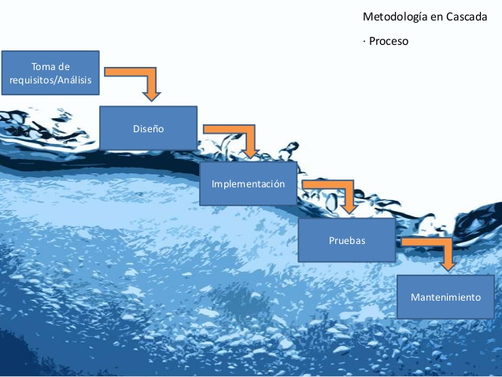
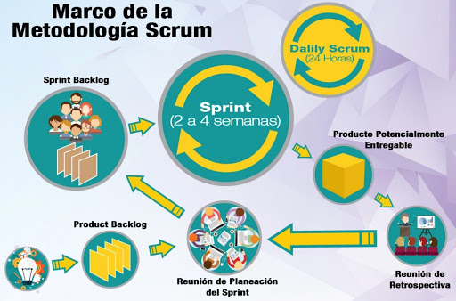
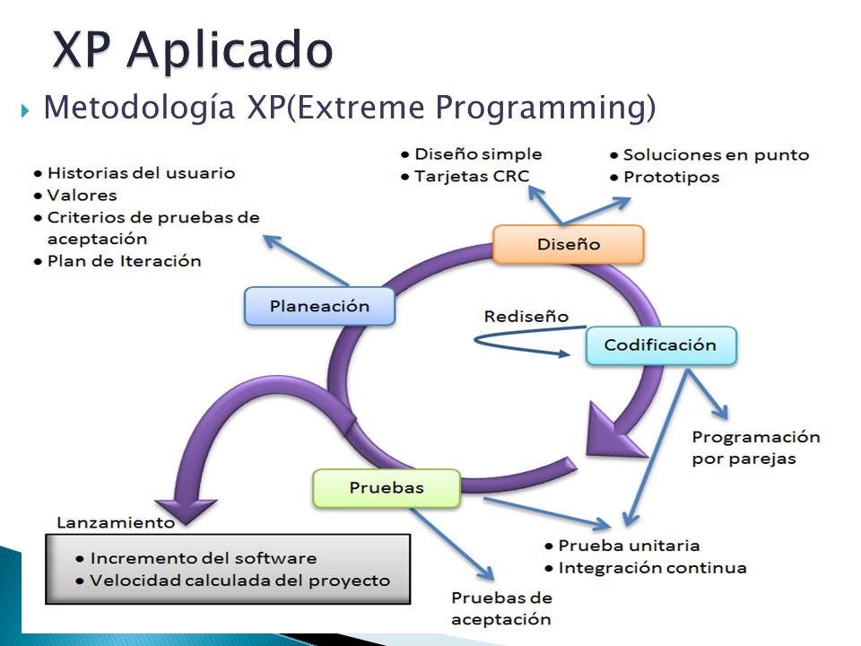

#Metodologias tradicionales
Estas metodologías tradicionales imponen una disciplina de trabajo sobre el proceso de desarrollo del software, con el fin de conseguir un software más eficiente. Para ello, se hace énfasis en la planificación total de todo el trabajo a realizar y una vez que está todo detallado, comienza el ciclo de desarrollo del producto software. Se centran especialmente en el control del proceso, mediante una rigurosa definición de roles, actividades, artefactos, herramientas y notaciones para el modelado y documentación detallada. Además, las metodologías tradicionales no se adaptan adecuadamente a los cambios, por lo que no son métodos adecuados cuando se trabaja en un entorno, donde los requisitos no pueden predecirse o bien pueden variar.

##Metodología en cascada:
El modelo de desarrollo de Software en cascada, es una metodología de la programación muy antigua. Si bien su creador nunca lo menciona como metodología en cascada, el funcionamiento y lineamiento de los procesos de la planeación, son exactamente iguales. Básicamente, el estilo del modelo en cascada, es que no podrás avanzar a  la siguiente fase, si la anterior no se encuentra totalmente terminada, pues no tiene porque haber vuelta atrás. Vamos a ver cuales son las fases de desarrollo de software del modelo en cascada, para que te puedas dar una idea.

1. Análisis de Requisitos.  El primer nivel del modelo cascada, es el análisis de requisitos. Básicamente lo que se documenta aquí, son los objetivos de lo que el software debe hacer al terminar el desarrollo, sin entrar en detalles de la parte interna, los cuales se verán durante el proceso. Sin embargo es importante señalar que una ves avanzado el paso de análisis, no puede haber vuelta atrás, pues la metodología para el diseño de software con la cual se trabaja no lo permitirá.

2. Diseño del Sistema. Todo lo que conlleva el armado de un diseño para el sistema que vayas a utilizar, es lo que continua después del análisis de requisitos. Aquí se elaborará lo que es la estructura del sistema y se determinarán las especificaciones para cada una de las partes del sistema que se planea desarrollar. Siendo del mismo modo, una fase a la cuál ya no se podrá volver después de haber bajado al nivel 3.

3. Diseño del Programa. En este punto, aún no ingresamos a lo que es la escritura de código, sin embargo ya se realizan los algoritmos que se van a utilizar en la programación. Si bien recuerdas, un algoritmo no necesariamente es código, simplemente tomas una hoja de papel y escribes el algoritmo que vas a utilizar. Esto es precisamente lo que se realiza en el paso número 3.

4. Codificación. Seguramente como programador, esta es la parte que estabas esperando, pues ahora es momento de empezar a escribir todo el código que será necesario para el desarrollo del software. Para este punto, la velocidad y el tiempo que se requiera, dependerá mucho del lenguaje de programación que vayas a utilizar. Pues algunos lenguajes de programación permiten utilizar componente, bibliotecas e incluso algunas funciones para reutilizar código, las cuales podrán acelerar el proceso de codificación en gran manera.

5. Ejecución de Pruebas. La codificación ha terminado y ahora es momento de verificar que nuestro sistema es realmente funciona, antes de que el cliente empiece a utilizarlo. Este es precisamente el objetivo de la fase 5 de pruebas. Aquí es recomendable que intentes mover lo más que se pueda tu software, con el objetivo de dañarlo intencionalmente, de este modo, si supera las pruebas de daño realizadas por tí, entonces estará listo para el usuario final.

6. Verificación. Después de haber realizado una gran cantidad de pruebas en la Fase 5, debemos migrar a la verificación. Esta fase consiste en la ejecución del Software por parte del usuario final. Si la fase cinco se realizó correcta y profundamente, el software no tendrá ningún tipo de problema y el usuario final quedará satisfecho con el resultado.

7. Mantenimiento. Seguramente te has dado cuenta, de que las aplicaciones o el software actual, constantemente se está actualizando. Esto se debe principalmente a que se le da mantenimiento al software, se solucionan errores, se quitan algunos bugs, se añaden funcionalidades, todo después de que el usuario final ya lo ha probado y utilizado en su fase final. Esta es posiblemente una de las fases más tediosas del modelo de desarrollo de software, pues debes estar atento a los comentarios de los usuarios, para ver que cosas son las que no funcionan correctamente y a las cuales hay que darles mantenimiento

###¿Cuáles son los Principios básicos del modelo de cascada?
Como puedes ver, el proceso de desarrollo de software con el modelo de cascada es bastante complejo. Sin embargo uno de sus principios es que cada una de las fases elaboradas, se encuentre documentada perfectamente, de este modo, si el desarrollo queda suspendido en alguna fase, cualquier usuario que quiera continuar con el proyecto lo podrá hacer leyendo la documentación.

Así también, es muy común encontrar metodologías para el desarrollo de software en cascada con fechas de objetivos, tiempos o presupuestos para determinadas fases. Aprovechando el hecho de que una ves que avanzaste de fase, es muy poco recomendable el volver atrás, aunque regularmente se tiene un cierto nivel de tolerancia, pero lo correcto en la utilización del modelo de cascada, es que no puedas ir atrás a realizar modificaciones de ningún tipo.

##Modelo Incremental o Iterativo y Creciente
El modelo Incremental, es una metodología de la programación muy utilizada hoy en día, pues su comodidad de desarrollo permite que te obtenga un producto final mucho más completo y exitoso. Se trata especialmente de la combinación de los modelos lineal e iterativo o bien, modelo de cascada y prototipos. Básicamente consiste en completar varias iteraciones de lo que es el modelo de cascada, pero sin completar ninguna, haciendo iteraciones lo que se hace es crear una evolución en el producto, permitiendo que se agreguen nuevas especificaciones, funcionalidades, opciones, funciones y lo que el usuario requiera después de cada iteración.

En pocas palabras, el Modelo Incremental repite el modelo de cascada una y otra ves, pero con pequeñas modificaciones o actualizaciones que se le puedan ir agregando al sistema. De este modo el usuario final se ve sumamente sumergido en el desarrollo y puedes proporcionarle un resultado óptimo.

Fases del Modelo Incremental
El modelo iterativo o incremental, cuenta con algunas fases de desarrollo de software que realmente no tienen mucha complejidad, vamos a verlas:

1. Inicialización. como en todo modelo de desarrollo, debe haber una inicialización, aquí se puede hablar de dar una idea, de tener algunos requisitos que se buscan en el proyecto y ciertas especificaciones que se pueden manejar. No es necesario que se haga una lista total de requerimientos pues recordemos que el proyecto se basa en iteraciones, así que el proyecto puede ir evolucionando poco a poco.

2. Periodos de Iteración. Durante el desarrollo del proyecto, es cuando damos inicio a las iteraciones. La primera iteración se realiza con las características iniciales, básicamente al final de la primer iteración, queda un pequeño prototipo de lo que será el proyecto, pero se puede volver a inicializar la iteración y realizar modificaciones en los procesos, como el análisis y las especificaciones o funciones que el usuario final requiere para su sistema.El número de iteraciones que se realicen son ilimitadas y dependerá tanto del desarrollador como del usuario final. Si nuestro objetivo es que el cliente o la persona que necesita el trabajo quede completamente satisfecha, entonces nos veremos en la necesidad de hacer la cantidad de iteraciones que se requieran al final del día.

3. Lista de Control. Es importante que conforme se vaya realizando cada iteración, se vaya llevando un control del mismo en una lista. Como si fuera un programa que recibe actualizaciones constantemente. Cada una de las actualizaciones o iteraciones deberá ser documentada y de ser posible, guardada en sus respectivas versiones, para que sea sencillo volver atrás, en caso de que una iteración no sea exitosa o el usuario ya no la requiera.

###¿Cuáles son los principios básicos del Modelo Incremental?
Es importante definir los siguientes principios fundamentales, pues nos permiten saber con claridad por donde va la idea de la metodología.

La idea de un modelo incremental, es utilizar una serie de mini modelos de desarrollo de software en cascada, segmentando requerimientos y permitiendo que el usuario vaya de la mano con el proyecto durante la realización.

Básicamente las fases de cada iteración, son las mismas que se manejan en el modelo de cascada, aunque también se pueden agregar algunas, pero su objetivo es completar cada fase de la iteración, para que esta se vaya complementando poco a poco y no se genere un desarrollo tedioso y cansado que puede alargar la duración del proyecto en demasía.

Debes saber, que cada iteración te generará un prototipo cada ves mas evolucionado, estos deberás guardarlos por si en determinado momento deseas volver atrás, pues a diferencia del modelo de cascada, podemos retroceder cuando se requiera y los prototipos se pueden volver a utilizar una y otra ves, pues el código fuente es reutilizable.

#Metodologias agiles
El desarrollo ágil de software envuelve un enfoque para la toma de decisiones en los proyectos de software, que se refiere a métodos de ingeniería del software basados en el desarrollo iterativo e incremental, donde los requisitos y soluciones evolucionan con el tiempo según la necesidad del proyecto. Así el trabajo es realizado mediante la colaboración de equipos autoorganizados y multidisciplinarios, inmersos en un proceso compartido de toma de decisiones a corto plazo.

##Metodología Scrum
Para que tengas una idea rápida, para que un proyecto ingrese al marco de lo que es el modelo Scrum, debe contar con las siguientes características:

-Desarrollo Incremental. Una metodología ágil sin desarrollo incremental, no puede ser considerada Scrum. Con incremental hago énfasis a olvidarnos de la planeación y de la ejecución de las lineas sin salirnos de lo pre establecido, pues con una metodología Scrum, el desarrollo se irá incrementando poco a poco, sin importar el orden en el cual se lleven a cabo los procesos.

-Calidad de las personas. Básicamente la calidad de un producto, no será analizada en base a la calidad de cada uno de los procesos llevados a cabo. Al contrario, la calidad dependerá de las personas, la auto organización y el conocimiento de los equipos de trabajo.

-Adiós al Secuencial y Cascada. Aquí en el modelo Scrum, hay algo a lo que se le denomina, solapamiento. Esto consiste en que no importa en que proceso te encuentres, si un proceso necesita ser trabajado, vuelves a el para realizar lo que tienes que hacer, a diferencia de las metodologías cascada o secuencial, donde no había vuelta atrás. Acá afortunadamente no hay ningún problema con eso y la ventaja es que se ahorran tiempos.

-La comunicación es Fundamental. Una de las cosas que se realizan, son los equipos de trabajo, sin embargo acá la ventaja que tendrás es que podrás estar en constante comunicación con los otros equipos de trabajo, nadie está envuelto en su propia burbuja y toda la información que se maneje o lleve a cabo, será comunicada sin problema.

###¿Como funcionan los Procesos Scrum?
La metodología Scrum, es bastante amigable y fomenta lo que es el trabajo en equipo en todo momento, con la finalidad de conseguir los objetivos de una forma rápida. Veamos ahora cuales son los procesos con los cuales funciona la metodología, empezando por el Product Backlog, el cual nos permitirá llegar a los Sprints, a continuación te explicaré de que te estoy hablando.

-Product Backlog. El Product Backlog no es más que una lista de las funcionalidades del producto a desarrollar. Este debe ser elaborado por el Product Owner, puesto que más adelante les explicaré. Sin embargo no se trata de una lista cualquiera hecha con escritos y nadamás. El Product Backlog debe estar ordenado de acuerdo a las prioridades del sistema de mas a menos, con la idea de que las cosas con mayor prioridad sean las que se realicen antes de cualquier cosa. De forma concreta, digamos que el objetivo base del Product Owner, es que nos de respuesta a la pregunta “¿Qué hay que hacer?”.

-Sprint Backlog. Una ves que ya contamos con el Product Backlog terminado, entonces aparecerá el primer Sprint Backlog. Pero ¿Qué es el Sprint Backlog? Consiste básicamente en seleccionar algunos de los puntos escritos en el Product Backlog, los cuales procederán a ser realizados. Sin embargo en este punto el Sprint Backlog tiene como requisito marcar el tiempo en que se llevará a cabo el Sprint.

-Sprint Planning Meeting. Antes de iniciar un Sprint, el cual es la fase de desarrollo, se realiza lo que es un Sprint Planning Meeting. En este proceso del Scrum, es una reunión que se realiza para definir plazos y procesos a efectuarse para el proyecto establecido en el Product Backlog. Algo importante que debes saber, es que cada Sprint, se compone de diversos features, que no son otra cosa mas que procesos o subprocesos que se deben realizar, puede ser la creación de un logo, la gestión de contenido, el diseño visual, etc. Todo dependerá del proceso que se desee llevar a cabo.

-Daily Scrum o Stand-up Meeting. Cuando un Sprint está en proceso, después de haber hecho la planeación del proyecto mediante plazos y procesos, entonces entramos a lo que son los Daily Scrum o Stand-up Meeting. Aquí básicamente lo que se hace son reuniones diarias mientras se está llevando a cabo un Sprint, para responder las siguientes preguntas: ¿Que hice ayer?, ¿Qué voy a hacer hoy, ¿Qué ayuda necesito?. Aquí entra en función el Scrum Master, un puesto que igual mas adelante les explicaré. Pero el será el encargado de determinar la solución de los problemas y cada complicación que suceda.

-Sprint Review. El Sprint Review, es básicamente una reseña de lo que fue el Sprint. Consiste específicamente en la revisión del Sprint terminado y para este punto ya tendría que haber algo que mostrarle al cliente, algo realmente visual o tangible para que se pueda analizar un cierto avance.

-Sprint Retrospective. Para concluir, el Sprint Retrospective, permite al equipo analizar los objetivos cumplidos, si se cometieron errores, visualizarlos y tratar de no cometerlos nuevamente mas adelante. Básicamente también sirve este proceso para lo que son la implementación de mejoras.

Equipos que Componen los Procesos Scrum
Durante el punto anterior, te describí los procesos que se llevan a cabo en la Scrum Metodología, y en varios puntos mencioné ciertos equipos que son encargados de algunos aspectos importantes. Por eso a continuación veremos cuales son los equipos que conforman la metodología Scrum y con los cuales se trabajará arduamente, obvio, cada quien con sus respectivas responsabilidades.

-Product Owner. Si se trata de tener un líder de proyecto, entonces el Product Owner lo será. Básicamente son los ojos del cliente, será la persona encargada del proyecto y de visorear que se lleve a cabo de tal forma que cumpla las expectativas de lo que se espera.

-Scrum Master. Ahora bien, para cada reunión realizada, siempre debe estar un líder, en este caso el Scrum Master será el lider de cada una de las reuniones y ayudará en los problemas que hayan surgido. Será básicamente como un “facilitador” el cual minimizará obstáculos, sin embargo no los omitirá. En realidad el Scrum Master debe ser una persona empapada de conocimientos sobre el lenguaje o lenguajes bajo los cuales se llevará a cabo el proyecto, de lo contrario no tendría como ayudar a solucionar problemas.

-Scrum Team. Básicamente es el núcleo de la metodología Scrum, pues es el equipo de desarrollo, encargado de lo que es la codificación del software y de cumplir los objetivos o metas propuestas por el Product Owner.

-Cliente. Aunque no lo creas, el cliente también forma parte del equipo, hablamos de eso hace un rato, cuando comenté que no es como en las metodologías tradicionales donde al cliente se le pedían requerimientos y se le daba un costo total. En la metodología Scrum, el cliente tiene la capacidad para influir en el proceso, debido a que siempre estará empapado de el, ya sea que proponga nuevas ideas o bien haciendo algún tipo de comentario.

##Metodología XP
Si hablamos de metodologías de la programación sin mencionar a la Metodología XP, es como no hablar de nada en absoluto. Esta metodología es posiblemente la mas destacada de las metodologías ágiles y esto se debe a su gran capacidad de adaptación ante cualquier tipo de imprevisto que surja. Pues la idea no es mantener ciertos requisitos desde que se está elaborando el proyecto, sino que durante el proceso, estos vayan cambiando o vayan evolucionando gradualmente sin complicaciones. Básicamente los creadores de esta metodología XP, consideran que es mejor adaptarte en el proceso a los requisitos que vayan apareciendo, que iniciar con requisitos y desarrollar un proyecto en base a eso.

Si queremos ver la metodología con otra perspectiva, se podría decir que la metodología XP o metodología de programación extrema, como también se le conoce. Es la combinación de las demás metodologías, solamente que se van utilizando de acuerdo a como sea necesario, por eso es considerada como la más destacada de las metodologías ágiles. Así que es momento de entrar en detalles y vamos a ver cuales son los valores que conforman a la metodología de programación XP.

###Valores de la Metodología XP
Como toda metodología, la programación extrema cuenta con algunos valores que son fundamentales para que se lleve acabo como debe ser. En algunas otras metodologías estos puntos los conocíamos como principios básicos, es realmente lo mismo solo que acá los mencionan como valores, veamos cuales son.

-Comunicación. Del mismo modo que otras metodologías como la Scrum, el cliente tiene una gran intervención, pero obviamente la comunicación dependerá de mas factores. Por ejemplo. El código fuente de los programadores debe transmitir esa comunicación a todo el equipo, por eso las variables amigables. De igual forma, se deben documentar las cosas mas relevantes, independientemente de que sean comentadas en el código, pero es importante tener un documento extra para explicaciones extensas, de lo contrario el código se verá infestado de escrito.En cuando a la comunicación entre personas, los programadores se comunican constantemente ya que trabajan en parejas, la comunicación que se tiene con el cliente debe ser constante, pues recordemos que incluso el forma parte del equipo de trabajo y es responsabilidad del cliente, comunicarnos algunas actualizaciones que requiera en el proceso, nuevas ideas, soluciones a problemas o sencillamente algún problema que el vea. Todo debe ser comunicado, esta parte es realmente fundamental para el desarrollo de un producto exitoso.

-Simplicidad. El primero de los valores de la metodología de programación XP, es la simplicidad. Ya te haz de imaginar en que consiste, puesto que la idea es que el desarrollo sea velóz, por lo cual todas las cuestiones de diseño se simplifican al máximo, lo mismo sucede con las lineas de código, si se pueden simplificar, se hacen, además de que regularmente el mismo código es donde va la documentación comentada, de esta forma nos evitamos el estar haciendo documentación extra.Por esta razón, además es importante que en el ciclo de desarrollo de software mediante la metodología XP, las variables, métodos y clases, tengan nombres amigables y relacionados, de este modo no solamente se ayuda el equipo de trabajo, el cual de por si ya se debe conformar de dos personas por equipo, si no que además, cuando una persona nueva ingrese al proyecto, será muy rápida su adaptación.

-Retroalimentación. El hecho de que el cliente se encuentre involucrado en el proyecto, ayudará inicialmente con la retroalimentación. Pues conforme pasan los días y se va analizando el código por pequeñas etapas, el cliente puede ir corrigiendo, agregando, quitando o excluyendo algunas cosas, esa es la ventaja de la programación por periodos cortos de tiempo, es decir, imagina que llevas varios meses desarrollando el proyecto y cuando vas con el cliente, el proyecto no le gusta y desea hacer tantos cambios que te llevará una eternidad. Precisamente eso es lo que se trata de evitar con la metodología XP, que se tiren varios meses de trabajo a la basura y mejor se vaya optimizando en pequeños lapsos de tiempo.Otra de las formas de retroalimentación con la cual contamos, es nuestro código fuente. Pues gracias a que podemos realizar diversas pruebas unitarias, podremos ver la salud de nuestro código, una gran ventaja, pues si hay problemas o errores, siempre estaremos a tiempo de realizar modificaciones y soluciones. A diferencia de un proyecto sumamente extenso, donde seguramente la cantidad de errores será tan impresionante que volver a empezar podrá ser una opción.

-Valentía. Hay elementos donde el coraje o la valentía de los programadores será fundamental. Por ejemplo el dar solución a los problemas frente a los cuales se enfrente. El pasar por la eliminación de código fuente en el programa desarrollado, aún cuando todo ese código haya tomado una gran cantidad de tiempo en hacerse o que tal el hecho de diseñar para hoy y no para mañana. Muchos lo hacen con esa idea en ocasiones, pero con un poco de valentía y coraje que forman parte de los valores de la metodología, seguramente el éxito llegará de manera anticipada.

-Respeto. Originalmente, este quinto valor no se encontraba en la metodología XP, sin embargo es importante mencionarlo pues hoy en día ya lo conforma. El respeto es importante para que haya una buena comunión entre los programadores del equipo. Nunca hay que denigrar a nadie ni agregar o ofender, pues un autoestima alta en el equipo garantizará un trabajo mucho más eficiente. Por esta razón, cosas como el código fuente, las modificaciones, los fallos obtenidos, los problemas o la solución de problemas, son procesos que se deben respetar para que el ambiente de trabajo también sea óptimo.

Características que componen la metodología XP
Ya vimos los valores o principios básicos, dejémoslo en valores pues así es como lo denomina la metodología, sin embargo ahora vamos a ver sus características, de esta forma te podrás dar una mejor idea de como funciona una metodología XP.

-Tipo de Desarrollo Iterativo e incremental. Como hemos visto en lo que llevamos hablando de la metodología XP, el método está basado en lo que son las mejoras continuas, a base de iteraciones y por supuesto un desarrollo incremental al estilo espiral.

-Pruebas Unitarias. Una de las características además son las pruebas unitarias. Se utiliza software de codificación eso si, dependiendo del lenguaje que estemos usando es la herramienta que nos corresponde, pero de este modo se analiza el código y solucionan errores, antes de validarlo y darlo por bueno.

-Trabajo en Equipo. Más especifico todavía, es el trabajo en parejas, el objetivo es que el enfoque en parejas sea mayor, las distracciones son menores y el aprendizaje del uno con el otro permite que el avance del proyecto sea mucho más eficiente que cuando una persona es la encargada.

-Alguien del equipo trabaja con el cliente. Es fundamental que el cliente intervenga en el desarrollo, pero obviamente el no estará en la sala de desarrollo, se debe asignar a una persona que sea le encargada de tener las reuniones con el cliente de forma constante. El será quien comunique al equipo los cambios o el seguimiento del proyecto.

-Corrección de Errores. Algo importante, el hecho de que la metodología XP sea realmente rápida para el desarrollo, no significa que se pasen por alto los errores, de hecho primero se le tiene que dar corrección a los errores antes de seguir avanzando en el proyecto.

-Reetructuración del Código. La idea es clara una refacturación del código siempre se debe realizar. Con esto lo que haremos es simplificar el código pero no las funciones. Pues regularmente cuando desarrollamos, agregamos algunas cosas que pueden ser innecesarias y que no afectan en el funcionamiento del sistema, estas son precisamente las que hay que refacturar.

-El Código es de todos. Realmente aunque se trabaje en equipos, al final todos tendrán la posibilidad de ver el código, proponer cambios o incluso hacerlos. La idea es que si uno no detecta un error, otro lo podrá hacer, por eso el código fuente es compartido entre todos.

-Código simple es la clave. Algo importante con la metodología extrema, es que la simplicidad siempre llevará la ventaja. Principalmente porque cuando se requiera hacer un cambio, si el código fuente es muy complejo, posiblemente lleve muchas horas realizar los cambios e incluso una alternativa seria ya no hacer ningún cambio para no perder tiempo. Esta es precisamente la razón por la cual el código simple, es fundamental en la metodología.

Básicamente, lo que es la simplicidad y la comunicación van de la mano. Puesto que a mayor simplicidad, la comunicación necesaria será menor. Haciendo que la eficiencia se incremente y la perdida de tiempo en comunicación sea menor. Por eso es importante seguir al pie de la letra estas dos ideales de la metodología.

Equipo de Trabajo dentro de una Metodología XP
Ya para concluir con esta metodología, recordemos que es una de las mejores que podrían existir y que realmente vale la pena implementar. Veamos cuales son los roles que componen el equipo de trabajo en un proyecto que se elaborará mediante la metodología XP, para que tengas una idea de la formación que se debe efectuar.

-Programador. Realmente no creo que sea necesario que te diga lo que hace el programador. Bueno, es el encargado del código del sistema y además de hacer las pruebas unitarias que se solicitan.

-Tester. Básicamente es el encargado de las pruebas del desarrollo. Lo que se vaya implementando, el teste lo prueba y le dice al cliente o mejor dicho, le comunica al cliente las pruebas funcionales, para posteriormente comunicarle al equipo los resultados.

-Tracker. El seguimiento será lo suyo. Será el encargado de realizar las comparaciones entre los tiempos estimados antes de empezar un desarrollo y los tiempos reales que se obtuvieron. Tratando siempre de mantener al tanto al equipo para que traten de mejorar los tiempos.

-Entrenador. Este elemento es realmente importante, puesto que es el responsable del proyecto básicamente y precisamente hace las funciones de un entrenador. Se encarga de guiar al equipo por el camino que deben seguir.

-Consultor. Regularmente el consultor no formaba parte del equipo, bueno de hecho no lo integra. El consultor sigue siendo un externo, pero que cuenta con conocimientos específicos y que será capaz de ayudar en la solución de problemas.

-Gestor. Posiblemente el líder más alto. Si se trata de unir a los clientes con los programadores, el gestor es el intermedio, es decir. Es el encargado de vincular e interrelacionar al cliente con los programadores.
